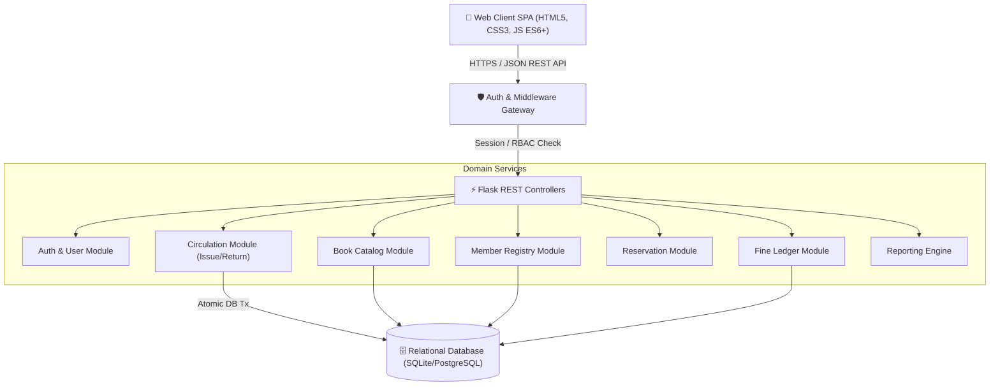
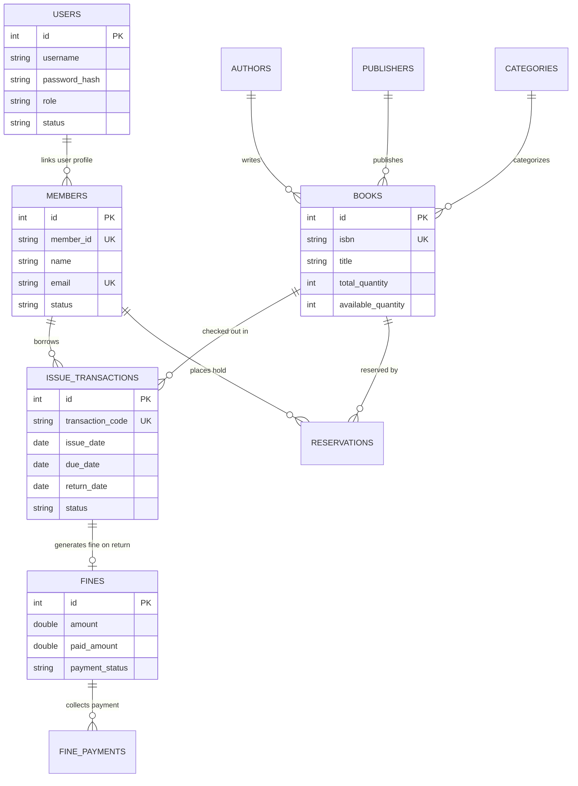

# 📚 Athena LMS - Enterprise Library Management System

[](https://www.python.org/)
[](https://flask.palletsprojects.com/)
[](https://www.sqlite.org/)
[]()
[]()
**🔗 Live Demo:** https://lms-3s3q.onrender.com
> Note: hosted on Render's free tier — first load may take ~30-50s to wake up if idle.
> A production-ready, full-stack **Enterprise Library Management System (LMS)** compliant with SRS v1.0 specifications and N-tier layered architecture. Designed with high data density, real-time analytics, RBAC permissions, atomic transaction handling, fine ledger processing, and CSV reporting.

---

## 🌟 Architecture & Key Features

### 🏛️ 3-Tier Layered Architecture


### 🗄️ Database Entity-Relationship (ER) Diagram


---

## ✨ Functional Highlights

- 🔐 **Role-Based Access Control (RBAC)**: Distinct permissions for `Admin`, `Librarian`, and `Member` sessions.
- ⚡ **Atomic Book Circulation**: Guaranteed single-transaction checkout and return enforcing:
  - Member active status check (BR-01)
  - Maximum borrowing limit check (BR-03)
  - Outstanding fine threshold restriction (BR-08)
  - Automatic inventory decrement on issue (BR-07) and increment on return (BR-06)
- 💰 **Overdue Fine Engine**: Dynamic overdue day calculation upon return based on configurable daily rates ($1.00/day).
- 🔖 **Hold & Reservation Queuing**: Prevents duplicate holds on out-of-stock titles (FR-46-50).
- 📊 **Executive Analytics & Data Export**: Interactive SVG velocity charts, inventory distribution, and one-click CSV report exports (`Inventory`, `Overdue Books`, `Issued Transactions`).
- 📜 **Enterprise Audit Logging**: Structured JSON logging capturing all administrative, book creation, and transaction actions (NFR-09).

---

## ⚡ Quickstart & Local Setup

### 1. Clone & Install Dependencies
```bash
git clone https://github.com/your-username/library-management-system.git
cd library-management-system

# Install Python requirements
python -m pip install flask werkzeug
```

### 2. Run Automated Unit Tests
```bash
python -m unittest backend/test_lms.py
```

### 3. Launch Web Application Server
```bash
python -m backend.server
```
Visit **`http://localhost:5000`** in your browser.

---

## 🔑 Quick Demo Login Credentials

| Role | Username | Default Password | Access Level |
|---|---|---|---|
| 🔑 **Admin** | `admin` | `Admin@123` | Full system control, user management, audit logs, system configuration |
| 📖 **Librarian** | `librarian` | `Lib@123` | Member registration, book management, circulation issue & return, fine collection |
| 👤 **Member** | `member1` | `Mem@123` | Catalog search, active hold reservation, borrowing history, fine ledger |

---

## 🛰️ REST API Specification Summary

| Endpoint | Method | Role Required | Description |
|---|---|---|---|
| `/api/auth/login` | `POST` | Public | Authenticate user & issue session token |
| `/api/books` | `GET` | Authenticated | Search & filter book catalog |
| `/api/books` | `POST` | Admin / Librarian | Add new book title |
| `/api/transactions/issue` | `POST` | Admin / Librarian | Atomic checkout issue to member card |
| `/api/transactions/{id}/return` | `POST` | Admin / Librarian | Record return & calculate overdue fine |
| `/api/reservations` | `POST` | Member | Place hold reservation on out-of-stock title |
| `/api/fines/{id}/pay` | `POST` | Admin / Librarian | Record fine payment collection |
| `/api/reports/export/{type}` | `GET` | Admin / Librarian | Download CSV report export |
| `/api/docs` | `GET` | Public | OpenAPI 3.0 API Specification JSON schema |

---

## 📄 License
This project is licensed under the MIT License - see the [LICENSE](LICENSE) file for details.
## Author
**Marshenil Mitra** — [GitHub](https://github.com/marshenilmitra) · [LinkedIn](https://www.linkedin.com/in/marshenilmitra)
